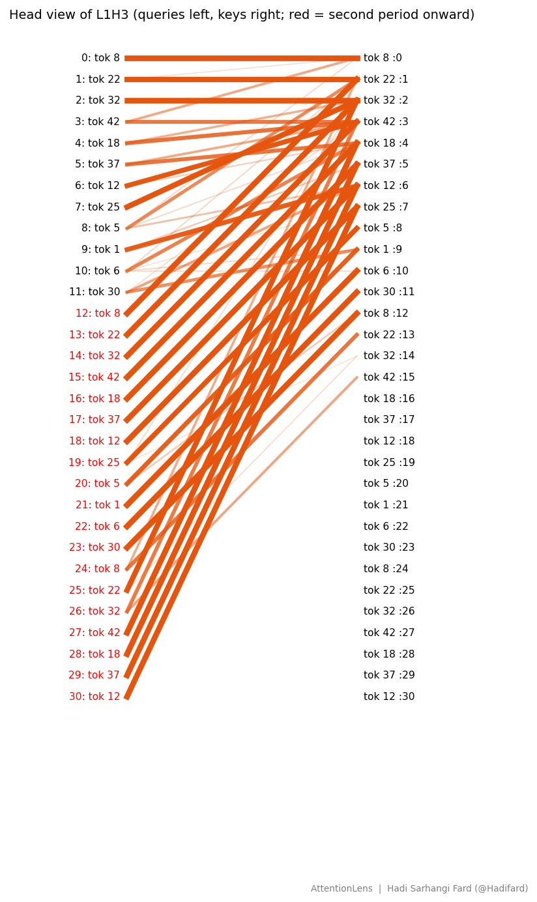
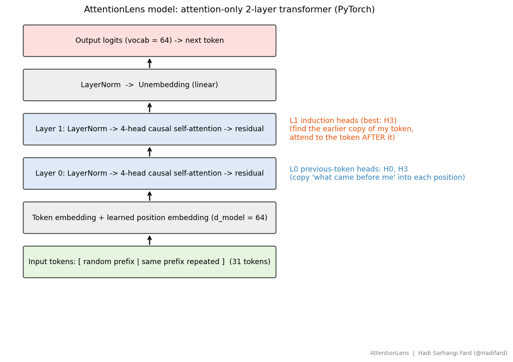
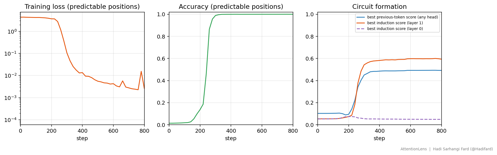
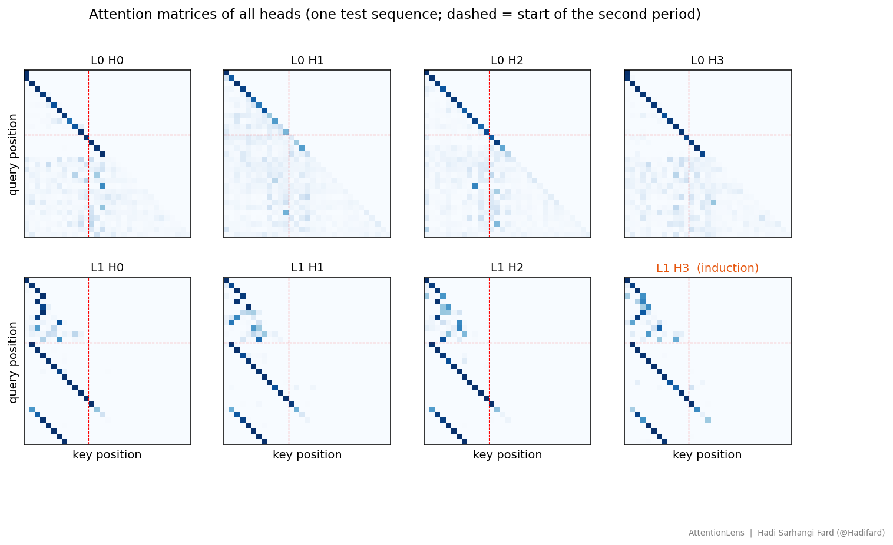
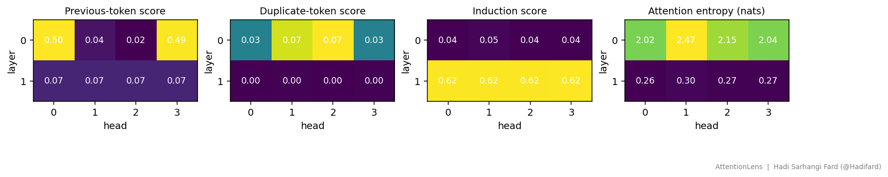
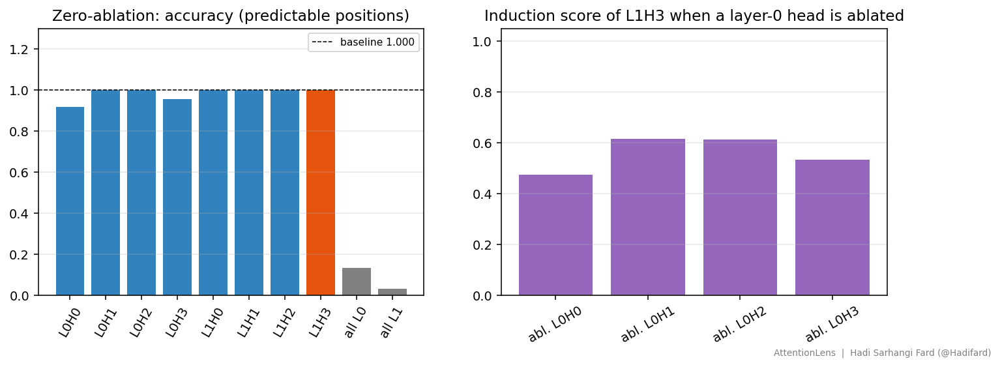

# AttentionLens: Explainable AI for Transformers

**Train a small transformer in PyTorch, open it up, and prove which attention heads implement which algorithm.**

A mechanistic-interpretability mini-project: a 2-layer, attention-only GPT-style model is trained from scratch to solve a task that *requires* looking back in the sequence. Afterwards every attention head is scored, ablated and visualised, which reveals the classic **previous-token head → induction head** circuit. A small browser viewer (BertViz-style) lets you explore the real attention weights.


---

## Table of contents

1. [Why this project exists](#why-this-project-exists)
2. [The key result in one picture](#the-key-result-in-one-picture)
3. [The task](#the-task)
4. [The model](#the-model)
5. [Quick start](#quick-start)
6. [Engineering analysis and results](#engineering-analysis-and-results)
7. [Interactive attention viewer](#interactive-attention-viewer)
8. [How it works under the hood](#how-it-works-under-the-hood)
9. [What is in this repository](#what-is-in-this-repository)
10. [Limitations and honest notes](#limitations-and-honest-notes)
11. [Credits](#credits)
12. [Author](#author)

---

## Why this project exists

Transformers dominate modern AI, but their internals are largely opaque. When models are used in sensitive domains (healthcare, finance, industrial systems), "it works" is not enough: we want to know **how** it works. Attention weights are a natural window into a transformer, and tools like BertViz made them popular, but attention maps alone can be misleading ("attention is not necessarily explanation").

This project goes one step further than looking at pictures. It follows a simple scientific loop:

1. **Observe** the attention patterns of every head.
2. **Hypothesise** what each head does (previous-token head, induction head).
3. **Quantify** the hypothesis with a numeric score per head.
4. **Intervene** by ablating heads and measuring the consequence.

Everything is trained and analysed with **PyTorch**, on a laptop CPU, in about two and a half minutes.

## The key result in one picture

The trained model reaches **100% accuracy** on held-out sequences, and the analysis shows *how*: two layer-0 "previous-token" heads and four layer-1 "induction" heads cooperate. Removing the layer-0 heads destroys the behaviour.



*Head view of layer 1, head 3 on a sequence with period 12 (queries on the left, keys on the right). From position 12 onward (red) every query token attends to the key located right **after the earlier copy of the same token**. For example, position 12 (token 8) looks at position 1 (token 22), which is exactly the token that must come next.*

## The task

Each sequence is a random prefix of **L unique tokens** (L is drawn from 6 to 16 for every sequence), repeated until 32 tokens are reached, e.g. for L = 4: `A B C D A B C D A B ...`

- In the first period the next token is unpredictable (random guess = 1/64).
- From the second period on, the next token is **fully determined**: find the previous occurrence of the current token and copy the token that followed it.
- Because L changes per sequence, the copy distance is not constant. A fixed positional shortcut cannot solve the task; the model has to use the **content** of the tokens.

> A first experiment used a constant L = 16. The model then solved the task with a single layer-0 head that simply looked back by a fixed 15 positions (a positional shortcut, no induction at all). Making the period variable was necessary to force a real induction circuit. This is a nice reminder that a model can reach perfect accuracy with a mechanism you did not intend.

## The model



| Property | Value |
| --- | --- |
| Type | Decoder-only transformer, attention-only (no MLP), pre-LayerNorm |
| Layers / heads | 2 layers x 4 heads |
| Embedding size | d_model = 64 (d_head = 16) |
| Vocabulary | 64 tokens |
| Context length | 31 input positions (learned position embeddings) |
| Parameters | **43,328** |
| Optimiser | AdamW, one-cycle learning-rate schedule (max 2e-3), batch 64, 6,000 steps |
| Loss | Cross-entropy on predictable positions only (t >= L) |
| Hardware | one CPU core, about 150 s |

## Quick start

```bash
git clone https://github.com/Hadifard/attentionlens.git
cd attentionlens
pip install -r requirements.txt

cd src/python
python train.py 6000          # trains the model, writes ../../results/model.pt and history.json
python analyze.py             # scores, ablations, figures -> ../../docs/images, metrics -> ../../results
python export_attention.py    # real attention weights as JSON for the browser viewer
```

Open `app/index.html` in a browser to explore the attention weights (see [Interactive attention viewer](#interactive-attention-viewer)).

## Engineering analysis and results

All numbers below come from `results/metrics.json` and were measured on **1,024 held-out sequences** that were never used for training (seed 2024). Accuracy is measured on predictable positions only.

### 1. Training dynamics: a sudden phase transition



The loss sits on a plateau close to ln(64) = 4.16 (random guessing) for roughly 200 steps. Then, within about 100 steps, the model discovers the algorithm:

| Step | Accuracy | Loss | Best induction score (layer 1) | Best previous-token score |
| ---: | ---: | ---: | ---: | ---: |
| 1 | 1.4% | 4.35 | 0.05 | 0.10 |
| 200 | 13.7% | 3.67 | 0.07 | 0.09 |
| 240 | 46.0% | 2.77 | 0.18 | 0.22 |
| 260 | 86.4% | 1.17 | 0.38 | 0.34 |
| 300 | 98.9% | 0.11 | 0.54 | 0.45 |
| 6000 | 100.0% | about 0 | 0.60 | 0.50 |

**Finding.** The previous-token score and the induction score rise **at the same time**, exactly when the loss collapses. The two heads are two halves of one circuit, and neither is useful alone. This is the well-known "induction head phase transition", reproduced here from scratch with 43k parameters.

### 2. What does every head look at?



Rows are query positions, columns are key positions, the dashed red lines mark the start of the second period. Layer-1 heads show sharp off-diagonal stripes (looking back one period), layer-0 heads show a diagonal or a soft spread.

### 3. Quantifying the heads

Three scores are computed per head (see `head_scores` in `src/python/train.py`):

- **Previous-token score**: attention from position t to position t-1.
- **Duplicate-token score**: attention from t to the earlier copy of the same token (t-L).
- **Induction score**: attention from t to the token *after* the earlier copy (t-L+1).



| Head | Previous-token | Duplicate-token | Induction | Entropy (nats) |
| --- | ---: | ---: | ---: | ---: |
| L0 H0 | **0.497** | 0.032 | 0.040 | 2.02 |
| L0 H1 | 0.045 | 0.066 | 0.049 | 2.47 |
| L0 H2 | 0.020 | 0.071 | 0.039 | 2.15 |
| L0 H3 | **0.495** | 0.032 | 0.039 | 2.04 |
| L1 H0 | 0.069 | 0.002 | **0.617** | 0.26 |
| L1 H1 | 0.069 | 0.002 | **0.618** | 0.30 |
| L1 H2 | 0.070 | 0.002 | **0.616** | 0.27 |
| L1 H3 | 0.069 | 0.002 | **0.621** | 0.27 |

**Findings.**

- Layer 0 contains **two previous-token heads** (H0 and H3). Layer 1 contains **four induction heads** (all heads), each with a score of about 0.62, whereas a random head scores about 0.05.
- The layer-1 heads have very low entropy (about 0.27 nats) compared with layer 0 (about 2 to 2.5 nats): they are sharp, selective lookups, not diffuse averages.
- The induction heads place about 62% of their attention mass on the correct key. Where the remaining mass goes was not analysed. A plausible but **untested** explanation is that, since the sequence is periodic, earlier periods (t-2L+1, ...) also contain the correct next token.

### 4. Ablation: which heads are necessary?



Each head's output is zeroed and the accuracy on held-out data is measured again.

| Intervention | Accuracy |
| --- | ---: |
| Nothing removed (baseline) | 100.0% |
| Remove L0 H0 (previous-token head) | 91.8% |
| Remove L0 H3 (previous-token head) | 95.5% |
| Remove L0 H1 or L0 H2 | 100.0% |
| Remove any single layer-1 head | >= 99.99% |
| **Remove both previous-token heads (L0 H0 + H3)** | **12.5%** |
| Keep only one induction head (L1 H3) in layer 1 | 86.0% |
| Remove all of layer 0 | 13.4% |
| Remove all of layer 1 | 3.3% |

**Findings.**

- **Redundancy.** Removing one head hardly matters, because the circuit has backup copies (2 previous-token heads, 4 induction heads). Removing *both* previous-token heads drops accuracy from 100% to 12.5%. Single-head ablation alone would have wrongly suggested that these heads are unimportant.
- **Composition.** The induction heads depend on the previous-token heads. The right-hand plot shows that the induction score of L1 H3 falls from 0.621 to 0.476 when L0 H0 is ablated and to 0.534 when L0 H3 is ablated, while ablating the unrelated L0 H1 or H2 leaves it unchanged (0.615 and 0.614). This is the signature of the two-layer induction circuit: layer 0 writes "the token before me" into each position, and layer 1 uses it to find "where did my token appear before, and what came next?".
- **A single induction head is not enough for full accuracy.** One head reaches 86%, four heads reach 100%: the heads add up.

### Summary of the engineering conclusions

1. The model solved the task through a **previous-token → induction** circuit, not through a positional shortcut (verified by the variable-period design and the ablations).
2. The circuit forms in a **sharp phase transition** around steps 200 to 320, with both head types appearing together.
3. The mechanism is **redundant**: conclusions drawn from single-head ablations alone would be misleading.
4. Attention maps were useful as a **hypothesis generator**; the scores and ablations are what turn the hypothesis into evidence.

## Interactive attention viewer

`app/index.html` is a dependency-free browser viewer that loads the real attention weights exported from the trained PyTorch model (`results/attention_sample.json`).

- **Head view**: token-to-token attention lines, one colour per head. Click a token on the left to see, for every head, which token it attends to most and with what weight.
- **Model view**: a grid of all layer x head attention matrices. Click a head to open it in head view.
- **Load JSON**: load your own export (format: `{tokens, attention[layer][head][query][key]}`), for example from another PyTorch or Hugging Face model.

To publish it as a live demo, enable GitHub Pages for the `app/` folder (or for the repository root and open `app/`).

## How it works under the hood

1. `data.py` builds the periodic random sequences and the mask of predictable positions.
2. `model.py` implements causal multi-head attention from scratch. Every forward pass returns the attention tensor of shape `(batch, layers, heads, T, T)`, and an optional `head_mask` zeroes selected heads for ablation.
3. `train.py` trains the model and, every 20 steps, evaluates accuracy and the per-head circuit scores on a fixed batch, which produces the phase-transition curves.
4. `analyze.py` computes entropy, ablation, circuit composition and generates all figures through `visualize.py`.
5. `export_attention.py` writes the real attention weights for the browser viewer.

## What is in this repository

This repository is a **curated overview** of the project: it contains the core PyTorch code that produces the results, the results themselves and the documentation. It is not the complete private working code.

```
attentionlens/
├── README.md
├── LICENSE
├── requirements.txt
├── app/
│   └── index.html               Browser viewer with the real attention weights embedded
├── docs/images/                 Figures used in this README (generated by analyze.py)
├── results/
│   ├── model.pt                 Trained weights (43k parameters)
│   ├── history.json             Training curves and per-step head scores
│   ├── metrics.json             All numbers quoted in this README
│   └── attention_sample.json    Attention weights of one sequence (period 12)
└── src/python/
    ├── model.py                 Causal attention + TinyGPT with head ablation
    ├── data.py                  Variable-period repeated-sequence task
    ├── train.py                 Training loop and per-head circuit scores
    ├── analyze.py               Entropy, ablation, composition study
    ├── visualize.py             Matplotlib figures
    └── export_attention.py      JSON export for the viewer
```

## Limitations and honest notes

- This is a **toy task** on a **tiny model** trained from scratch. The findings show a mechanism, not a statement about large language models such as GPT-2, although induction heads have been reported in those as well.
- Results come from **one training run** (seed 0). A proper study would repeat the experiment with several seeds and report the variation.
- Head scores use fixed positions derived from the task structure, so they are specific to this task.
- Zero-ablation is a blunt intervention. Mean-ablation or activation patching would be more precise.
- Attention weights alone are not a full explanation (Jain and Wallace, 2019). That is why this project combines them with scores and interventions.

**Ideas for extension:** several seeds, an MLP-enabled variant, activation patching, and applying the same score and ablation pipeline to a pre-trained Hugging Face model.

## Credits

- Inspired by the article "Explainable AI: Visualizing Attention in Transformers" (Comet) and the BertViz tool by Jesse Vig.
- Conceptual background: "A Mathematical Framework for Transformer Circuits" and "In-context Learning and Induction Heads" (Anthropic).
- Jain and Wallace (2019), "Attention is not Explanation".

## Author

**Hadi Sarhangi Fard**, AI engineer with a mechanical engineering background.

- GitHub: [@Hadifard](https://github.com/Hadifard)
- LinkedIn: [Hadi Sarhangi Fard](https://www.linkedin.com/in/hadi-sarhangi-fard-mech-eng/)

If this project helped you understand attention a bit better, a star on the repository is very welcome.

## License

Released under the [MIT License](LICENSE).
